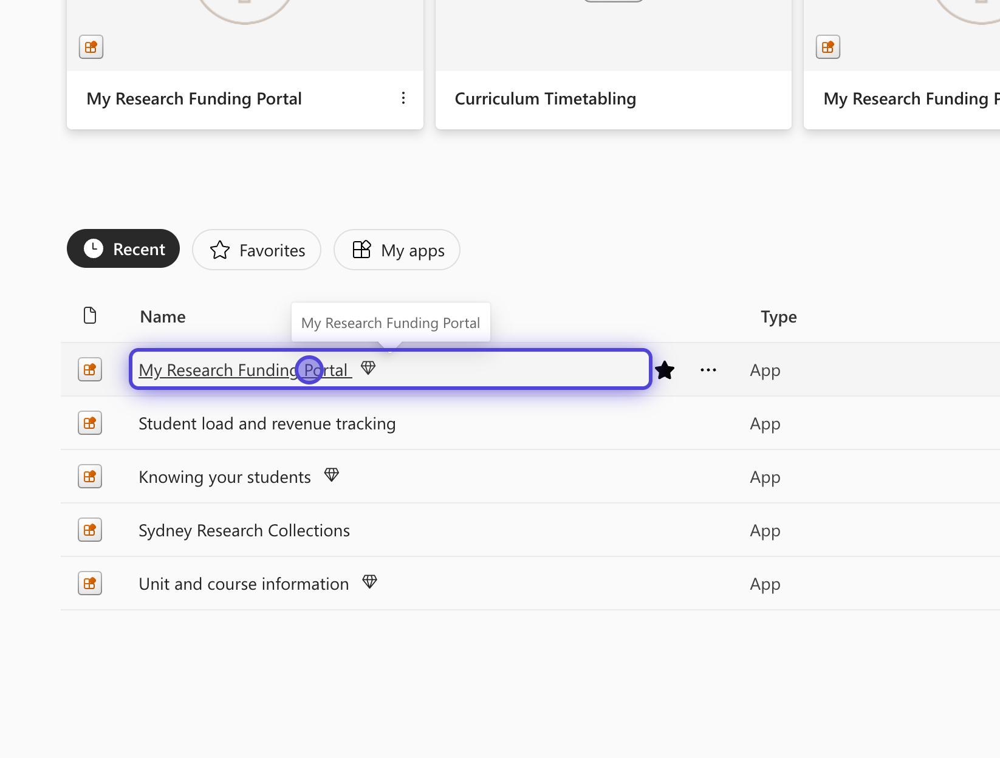
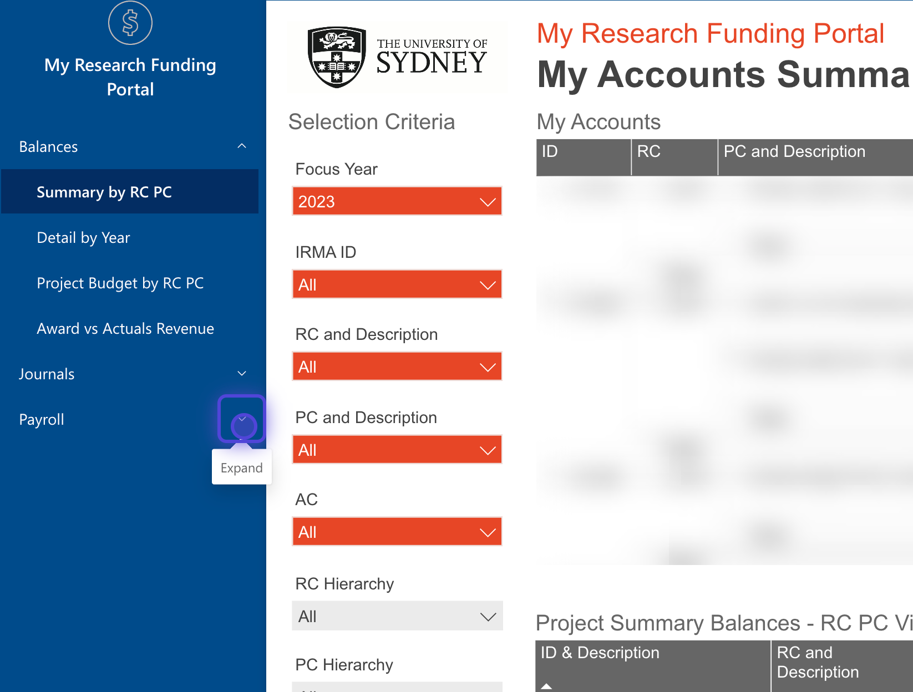
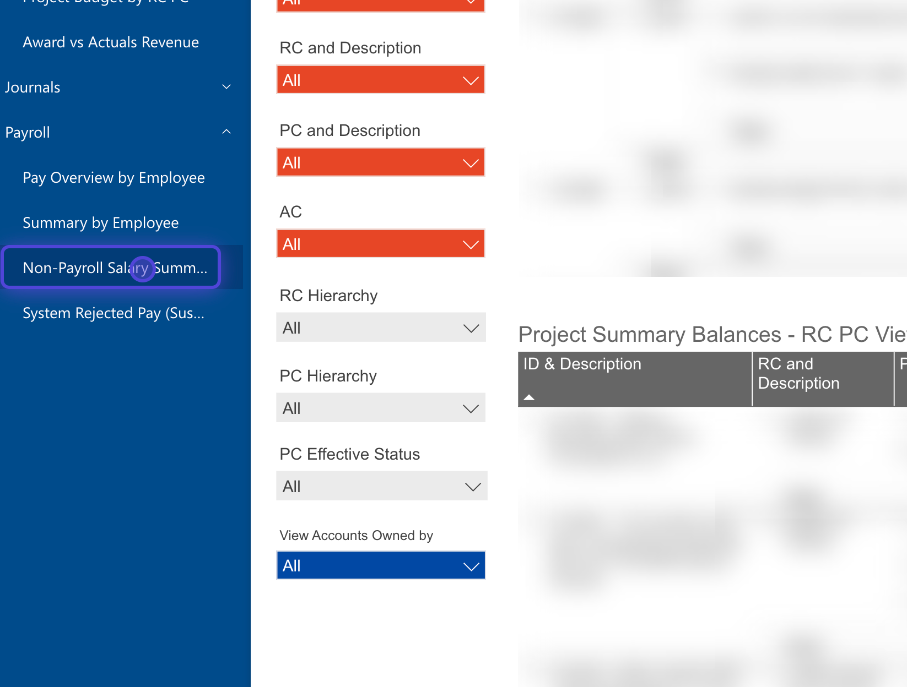
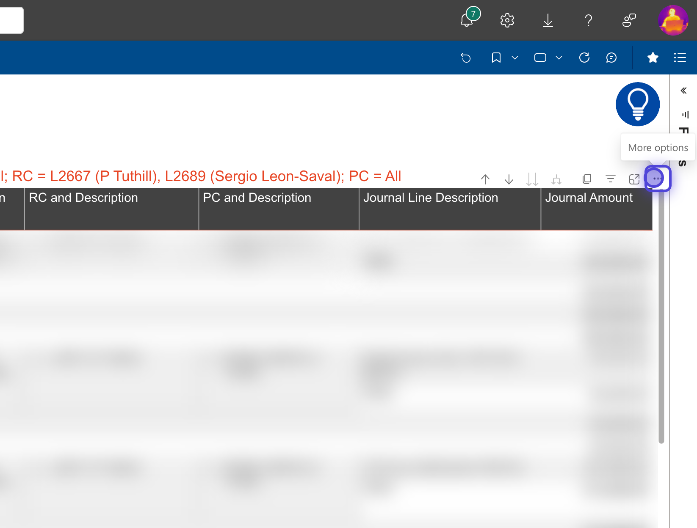
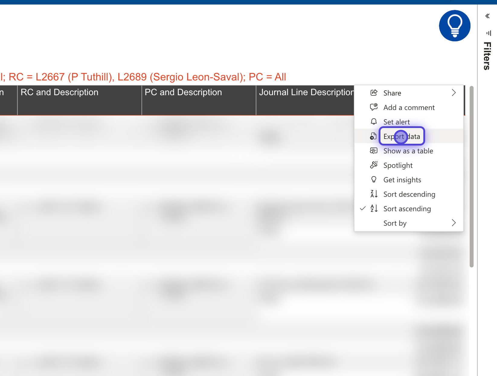
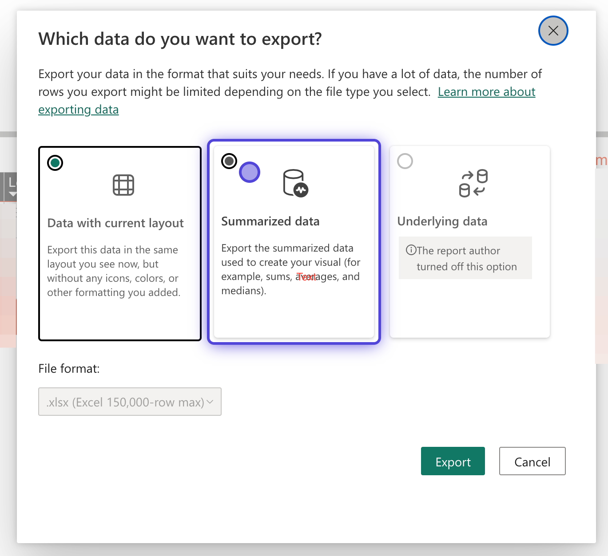

Guide MRFP export Salary Journals data for budget spreadsheet
====================================================================

* * *

Created by Chris Betters on 16/11/2023

* * *

If you have had an journal transfer related to salary, they appear here.

### 1\. Open on My Research Funding Portal
Power BI is part of Office 365. You can find it via [sydney.edu.au/o365](https://app.powerbi.com/?tenant=82b3e37e-8171-485d-b10b-38dae7ed14a8) or at [here](https://app.powerbi.com/?tenant=82b3e37e-8171-485d-b10b-38dae7ed14a8).

If you do not have access you may need to request it. More information is avalaible on the [intranet](https://intranet.sydney.edu.au/research-support/managing-research/managing-your-funding/my-research-funding-portal.html)

### 2\. Open Payroll Section in left sidebar

### 3\. Click on Non-Payroll Salary Summary

### 4\. Click on highlighted part of image - table "..." menu.

### 5\. Click on Export data

### 6\. Export Summarized data.
The default will be "Data with current layout". We want to use the summaized version. Click export when ready and save to same directory as your budget.

