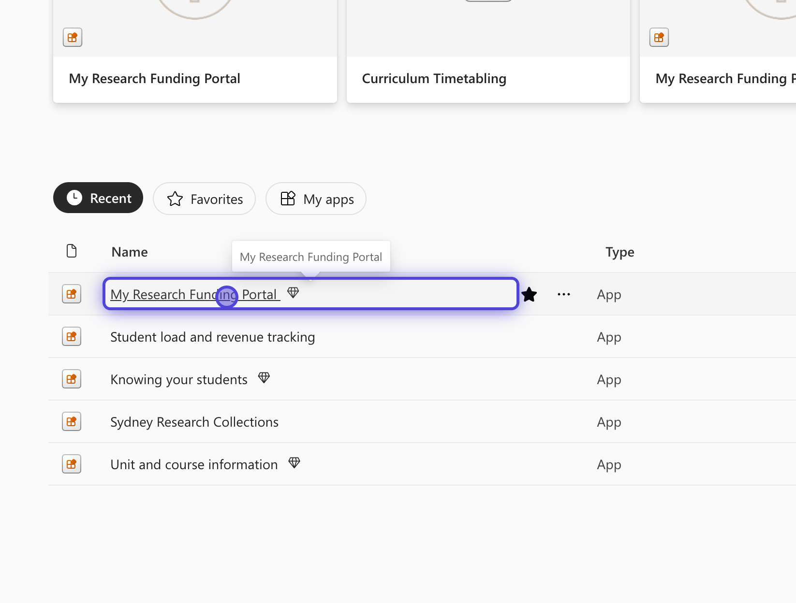
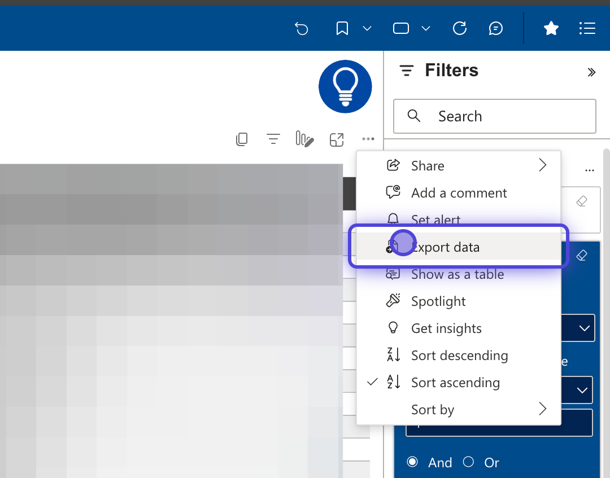
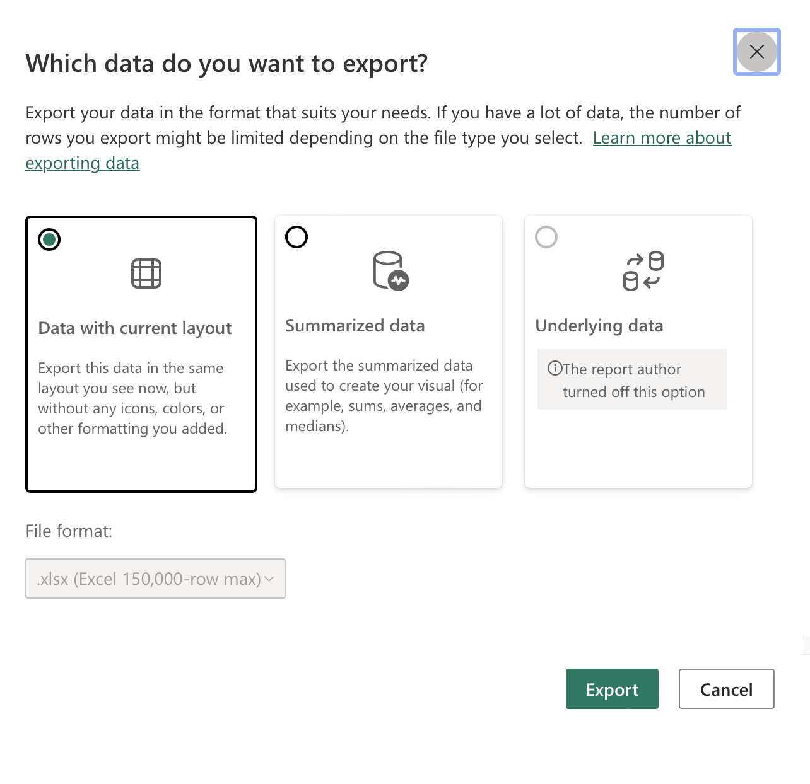

How to export expenses only from MRFP (excluding HR/Salray data).
==================================

* * *

Created by Chris Betters on 16/11/2023

* * *

### 1\. Open on My Research Funding Portal
Power BI is part of Office 365. You can find it via [sydney.edu.au/o365](https://app.powerbi.com/?tenant=82b3e37e-8171-485d-b10b-38dae7ed14a8) or at [here](https://app.powerbi.com/?tenant=82b3e37e-8171-485d-b10b-38dae7ed14a8).

If you do not have access you may need to request it. More information is avalaible on the [intranet](https://intranet.sydney.edu.au/research-support/managing-research/managing-your-funding/my-research-funding-portal.html)

### 2\. Expand journals section
Once in Power BI, we want to expand (if it is not already) the Jounral section in the left sidebar.

### 3\. Click on Expenditure Actuals
All expenses that have actaully occured get listed in Expenditure Actuals.

### 4\. Sort By Posted Date
This is **important** for consistenty in the order of exported data. I recomended sorting old first, but the most import thing is to always use same sorting order. You may need to scoll to right in the data table to **Posted Date**.

### 5\. Select what RC and PC combo you want data for.
If you only want some accounts to exported you can slected these here. Otherwise the simplest options is to choose all.

### 6\. Click on the table area (not headers)

This will display filters on the right side that apply to the expenses table. These filters enable us to exclude certain expenses, specifically all HR-related items. Since this information is more accurately captured in the Payroll section of the MRFP, it is unnecessary here.

### 7\. Open CC and Description filter card.
On the right hand side bar will be list of differnt filers for each table column. We want to filter on **CC and Description**.

### 8\. Enter Filter information.

Using Advanced filtering, and show items "does not start with" and enter value "4". All HR expense codes start with "4", so this will exclude them from this list.

### 9\. Click on highlighted part of image - table "..." menu.

### 10\. Click on Export data

### 10\. Chose format fo exported data. 

The default will be "Data with current layout". This is what we will use. Click export when ready and save to same directory as your budget.

