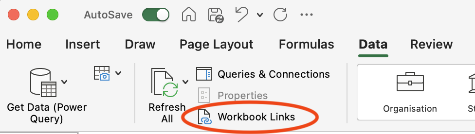

Guide to setting up MRFP Budget Tool
==================================

* * *

Created by Chris Betters on 24/05/2024

* * *
## Preamble
I developed this tool to help with the budget management of the TOLIMAN project. The current MRFP system does not provide a suitable way of evaluating the status of a project's expenditure and planned expenditure/commitments. It does, however, provide a thorough listing of expenses, which can be used to develop a project-specific budget.

## 1. Get Required data from my MRFP
Refer to the following:

- Guide to export expenses from MRFP
- Guide to export Salary Journals data from MRFP
- Guide to export Salary data from MRFP

Add the exports from theses steps to the same folder (I recomend in Onedrive, but this can also be local if prefered).

## 2. Open the Budget Tool in excel.
These instructions are based on the macOS version of Excel, but they should also apply to the Windows version (though some views may look slightly different). 

> If you see a prompt or warning about external data connections, click to enable them.

## 3. Establish external data connections
### Initial Warning
If you have copied the template the connections wil be broken, and will fix them in the following steps. 
Click on **Manage Workbook Links** and got to "3. Establish New Links to MRFP exports"
If you do not see an error or warning go to "Open Workbook Links".

### Open Workbook Links
In the Excel Ribbon toolbar, open the **Data** panel and click **Workbook Links**.

## 3. Establish New Links to MRFP exports
There will be three workbooks to link: expenses, salary and salary journal. 
For each:

1. Click on file and then click the "**...**" menu. 
2. Click on each on **change source**.
3. Select the coresponding MRFP export file.

## 4. Check link is working.
The three tabs, "Expenses", "SalaryByEmployee", "SalaryJournal", should be reproducing the data from your exported spreadsheets.

If you have "\#REF" issues, you may need to start again or consult CHB.

## 6. Develop you budget
The following steps will involve coding your expenses against your budget categories. This process will be very project-specific, but there are a few key categories to consider. The simplest approach is likely to use the budget from a funding proposal as a starting point and refine it as needed.

Please note, when adding rows, that the formula in the yellow salary field is different from the one in the rest of the spreadsheet.

### Add your accounts to the income section.
The tool will provide lookup table based on all the PC accounts seen in the expense table. Pick an account for each column. More columns can be added, but some formating will need to be done, and formulas translated to new cells.

In the Budget section either include your total award amounts or expected total incomes. Currently actaul revenue is manually filled into this section vs using MRFP data. For ARC budgets, I recommended duplicating in the award amount for simplicity.

### Add your budget to expenses section.

Fill in planned or anticipated amounts in the budget column. This does require external reference, for example how much a 3 year postdocs will cost (I suggest using the university Project Budget Tool or salary tables to estimate this kind of thing).

### Some extra notes on developing a budget (ChatGPT)

Developing a budget for a research project involves outlining and estimating costs in several key categories:

1. **Personnel**: Salaries and wages for researchers, assistants, and other staff involved in the project. This also includes fringe benefits and stipends for students or postdocs.

2. **Materials and Supplies**: Costs for lab equipment, chemicals, software, and other consumables required for the research.

3. **Equipment**: Expenses for purchasing or leasing major equipment essential to the project. This can include computers, specialized instruments, and other durable items.

4. **Travel**: Funds for conferences, fieldwork, or collaboration with other institutions. This includes airfare, lodging, meals, and transportation.

5. **Publication and Dissemination**: Costs for publishing research findings in journals, producing reports, and other means of sharing results.

6. **Facilities and Administrative Costs (Indirect Costs)**: Overhead costs associated with the use of institutional resources, such as utilities, administrative support, and maintenance of facilities.

7. **Consultants and Subcontracts**: Payments to external experts or organizations providing specialized services or collaborative work.

8. **Miscellaneous**: Any other expenses not covered in the above categories, such as participant compensation, insurance, or contingency funds.

## 5. Code Any Salary Expenditure
Payroll expenditure coding has been simlified using a unique list of all employee names and a look up table of budget line items. This table will be used to automaticaly categorise salary data.
For each employee selected the approporate budget line item. Multiple people can be grouping in one category if needed.

### Non-Payroll Salary
Non-Payroll salary expenditure occurs when some salary cost is handled via a jounral transfer instead of via payroll. The most commone example is when transfering the salary expenditure from one account to another.

The journal record does not always have information about the employee, only the description. For this reason the user needs to asscoaite the expense with an employee. A lookup table using the Salary Coding informations is provided to make this easier.

### Confirm this is working
In your budget sheet, you should now see expense information populated in salary categories.

## Code Expenses
The last step is to code all remaining expenses in **Transactions Coding** sheet. Like other areas, there is lookup table to pair expneses to budget line items.  The **Transactions Coding** sheet is a subset of columns avalaube in the expense jounral sheet to make reading easier.

## Troubleshooting
### Lookup tables
Sometimes the loop up table get broken. These are setup using "Data Validation" feature in excel. To repair, select the desired cell and click "Data Validation" button in the Data ribbon.

Using settings like the following to make a lookup table for budget line items:

